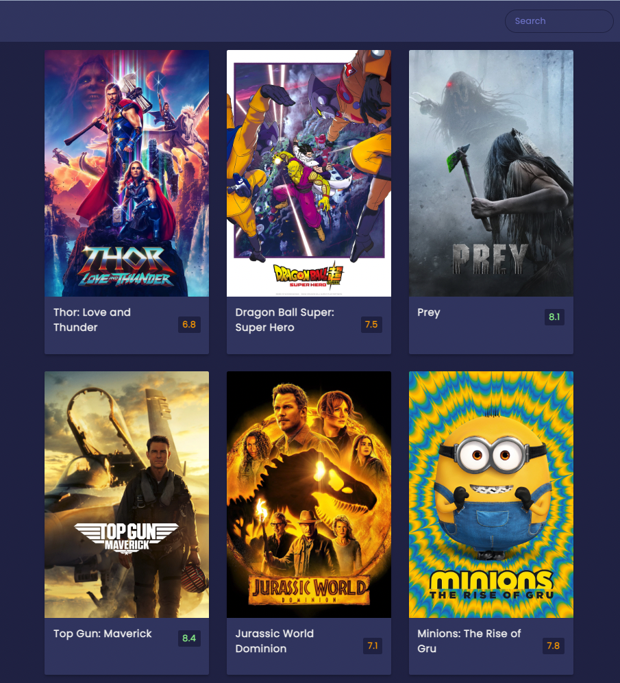

## Table of Contents
1. [General Info](#general-info)
2. [Technologies](#technologies)
3. [Start](#start)

### General Info
***
You have heard about a new movie and you would like to have more information about it? Then Movie App is the solution.
### Screenshot

## Technologies
***
A list of technologies used within the project:
* HTML5
* CSS3
* Javascript

## Start
***
just run the Html5 index file (index.html)

